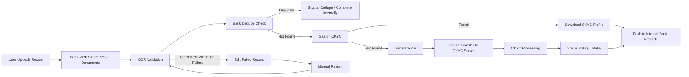

# CKYC Application Demo

This repository contains an MSc Software Engineering student project that explores how a bank-facing KYC workflow can be automated, validated, and integrated with a simulated Central KYC service. The project is not intended to represent a production banking platform. It is a research and demonstration system built to study workflow orchestration, document validation, secure data exchange, retry handling, and auditability across multiple cooperating applications.

## Project Overview

Know Your Customer (KYC) processes are usually fragmented across manual document checks, duplicate detection, external registry lookups, secure file exchange, and internal customer onboarding. This project brings those pieces together into one demonstrable workflow.

The repository contains:

- `Bank-Web`: the main ASP.NET Core banking application
- `CKYC.Server`: a separate ASP.NET Core service that simulates the external Central KYC side
- `ckyc-ui`: a React frontend used to drive and demonstrate the banking workflow

The current implementation supports:

- manual single-record upload
- React/API-based single-record upload
- MVC form upload
- bulk ZIP-based upload with Excel + document packaging
- OCR-based PSC validation
- internal dedupe checks
- CKYC search and download flow
- ZIP generation and secure transfer to the simulated CKYC service
- queue/background-worker automation with retry support
- manual recovery and restart for permanently failed records

## Problem Statement

In real onboarding environments, KYC processing is often slow, repetitive, and operationally fragile. A customer record may pass through several different stages:

1. document collection
2. OCR and validation
3. duplicate checking within the bank
4. search against an external KYC repository
5. secure submission if no external record is found
6. status polling and final onboarding into internal systems

When any of these steps fail, users often have poor visibility into what happened and how to recover. This project investigates how an automated workflow can:

- reduce repetitive manual steps
- provide clearer state tracking
- support controlled retries
- preserve auditability
- allow human recovery when a permanent validation failure is corrected later

## Research Context

This project was developed as part of an MSc Software Engineering context, where the emphasis is on:

- modelling a realistic multi-system workflow
- designing for maintainability and traceability
- exploring orchestration and error recovery patterns
- demonstrating how UI, APIs, background processing, persistence, and external integration fit together

The focus is not just on producing a working interface, but on examining system behaviour across success, retry, failure, and manual recovery scenarios.

## CCR vs CKYC

This project is about **CKYC**, not **CCR**.

- **CCR (Central Credit Register)** is generally concerned with credit reporting and exposure data.
- **CKYC (Central KYC)** is concerned with reusable customer identity and KYC information.

The distinction matters because the workflows are different:

- CCR-style systems are oriented around lending and credit reporting.
- CKYC-style systems are oriented around identity verification, onboarding, record retrieval, and document handling.

This repository models a **CKYC workflow** where the bank checks whether a customer identity already exists, downloads an existing profile when possible, or submits a new record when no match is found.

## System Architecture

At a high level, the system has three parts:

1. `Bank-Web`
   - ASP.NET Core MVC + API application
   - stores staged KYC uploads and internal bank customer records
   - runs OCR validation, dedupe, CKYC search/download, ZIP generation, SFTP upload, status polling, and push-to-internal logic
   - hosts the background retry worker

2. `CKYC.Server`
   - separate ASP.NET Core service
   - simulates the external CKYC platform
   - accepts uploads, processes ZIP packages, stores CKYC profiles/documents, and exposes search/download/status endpoints

3. `ckyc-ui`
   - React application
   - presents dashboard, records list, details, and bulk upload management
   - consumes the `Bank-Web` API

### Data Flow Summary



## Key Features

- `KYC-YYYYMMDD-######` request/KYC ID generation
- OCR validation of PSC front and back documents
- exact dedupe against existing internal bank customer records
- CKYC search with encrypted/decrypted response persistence
- CKYC download path for record-found cases
- ZIP package generation for fresh-record submission
- secure transfer to the simulated CKYC side
- worker-based queue processing instead of only request-thread automation
- retry support for temporary conditions such as delayed status availability
- manual restart after permanent failure once data is corrected
- React dashboard with status distribution and county-wise breakdown
- bulk upload support using the packaged Excel template format

## Technology Stack

### Backend

- .NET 8
- ASP.NET Core MVC
- ASP.NET Core Web API
- Entity Framework Core
- PostgreSQL

### Frontend

- React
- Axios
- React Bootstrap
- Chart.js

### Supporting Concerns

- OCR service abstraction for PSC validation
- AES-based encrypted payload storage
- SFTP-based transfer simulation
- hosted background worker for automation retry

## Current Workflow Summary

### Single Upload

1. User submits a KYC record through React/API or the MVC form.
2. `Bank-Web` stores the staged record and PSC images.
3. A `KYC-YYYYMMDD-######` request reference is generated.
4. The record is queued for automation.
5. The background worker picks it up and starts processing.

### Background Worker Processing

1. Validate PSC front OCR against expected customer name.
2. Validate PSC back OCR against expected PPSN.
3. Run dedupe against existing bank customer records.
4. If dedupe passes, complete locally without CKYC submission.
5. If dedupe fails, search CKYC.
6. If CKYC finds a record, download it and push to internal bank records.
7. If CKYC does not find a record, generate a ZIP and submit it.
8. Poll CKYC status on later attempts when necessary.
9. Push the successful result into internal bank records and mark the workflow complete.

### Bulk Upload

1. User uploads a ZIP package containing:
   - `data/*.xlsx`
   - `psc-front/*`
   - `psc-back/*`
2. `Bank-Web` reads the package and validates the rows.
3. Valid rows become individual `KycUploadDetails` records.
4. Each created row is queued for the same background automation path as a single upload.
5. The bulk UI reflects the state of the linked KYC records rather than just import success.

### Record Found Path

1. OCR passes
2. dedupe fails
3. CKYC search finds an exact identity match
4. CKYC profile is downloaded
5. response artifacts are stored
6. internal bank customer record is created/updated
7. workflow completes without ZIP submission

### Fresh Record Path

1. OCR passes
2. dedupe fails
3. CKYC search returns no match
4. ZIP is generated
5. ZIP is securely transferred to `CKYC.Server`
6. CKYC status is checked
7. worker retries while waiting for status
8. CKYC returns success
9. bank pushes the result into internal records
10. workflow completes

### Failed Validation Path

1. OCR or validation step fails
2. record moves to terminal failed state
3. user/admin can edit the failed record
4. corrected data can be saved
5. user/admin can manually restart automation
6. stale artifacts are cleared and processing starts again from the beginning

## Current Implementation Status

The project currently supports the major flows needed for demonstration:

- single upload through API and MVC
- bulk upload through packaged ZIP files
- queue-based automation
- temporary retry handling
- permanent-failure edit and restart
- CKYC search/download and fresh submission paths
- dashboard and records views for monitoring results

The system has been used with demo-ready datasets including:

- fresh successful records
- CKYC record-found cases
- dedupe-pass cases
- OCR-failed cases that can be edited and restarted

Known limitations remain, as expected in an academic prototype:

- some build warnings are still present
- demo/test data accumulates unless cleaned manually
- dashboard alert logic is intentionally simple
- secrets and local connection settings must be configured per machine

## How to Run the Project

### Prerequisites

- .NET SDK 8
- Node.js
- PostgreSQL
- local configuration for database connection strings
- local development certificates/trust for HTTPS if required

### Repository Structure

- `Bank-Web`
- `CKYC.Server/CKYC.Server`
- `ckyc-ui`

### Notes Before Running

- The solution file currently includes `Bank-Web` only.
- `CKYC.Server` and `ckyc-ui` are companion applications in the same repository and should be run separately.
- Review local `appsettings` / development settings before running.

### Start the Services

#### 1. Start CKYC.Server

```powershell
dotnet run --project CKYC.Server/CKYC.Server/CKYC.Server.csproj
```

#### 2. Start Bank-Web

```powershell
dotnet run --launch-profile https --project Bank-Web/Bank-Web.csproj
```

#### 3. Start React UI

```powershell
cd ckyc-ui
npm install
npm start
```

### Default Local URLs

- React UI: `http://localhost:3000`
- Bank-Web: `https://localhost:7094`
- CKYC.Server Swagger: `https://localhost:7147/swagger`

## Demo and Testing Notes

For live demonstration, the most useful scenarios are:

- a fresh record that goes through the full CKYC submission path
- a record found in CKYC
- a dedupe-pass record that stops at internal matching
- an OCR-failed record that can be corrected and restarted
- a bulk file showing a mixture of those cases in one run

The repository has been exercised with:

- manual single uploads
- API-based single uploads
- MVC form uploads
- bulk ZIP uploads
- retry/waiting-status cases
- manual restart after terminal failure

## Academic Disclaimer

This repository is an MSc Software Engineering student project. It is intended for learning, experimentation, demonstration, and discussion of software engineering techniques in a KYC workflow domain. It should not be treated as a production-ready banking system.
